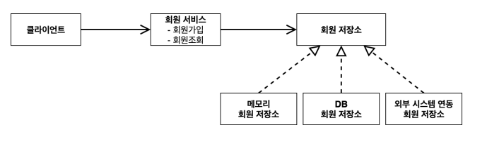
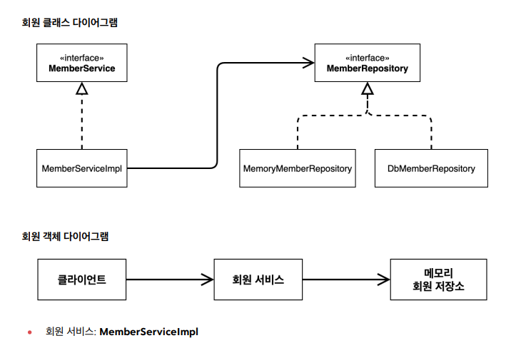
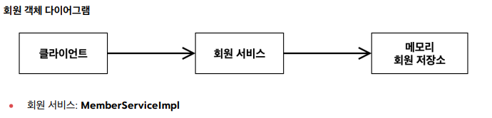

# 회원도메인 설계
* 회원 도메인 요구사항
    * 회원을 가입하고 조회할 수 있다.
    * 회원은 일반과 VIP 두 가지 등급이 있다.
    * 회원 데이터는 자체 DB를 구축할 수 있고, 외부 시스템과 연동할 수 있다.(미확정) 

\* 회원 도메인 협력 관계 \*

\* 회원 클래스 다이어그램 \*

\* 회원 객체 다이어그램 \*

* 도메인 다이어그램 
    * 기획자도 볼 수 있는 것
* 클래스 다이어그램
    * 도메인 다이어그램을 바탕으로 개발자가 만들어 냄
    * 실제 서버를 실행하지 않고 클래스들만 분석해서 볼 수 있는 그림
* 객체 다이어그램
    *  클래스 다이어그램에 구현체들은 동적으로 채워져서 클래스 다이어그램만으로는 판단하기 어려움
    * 실제 new 한 인스턴스끼리의 참조