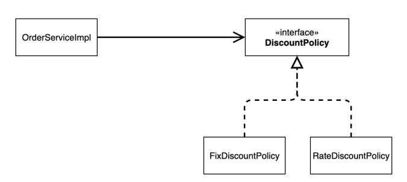
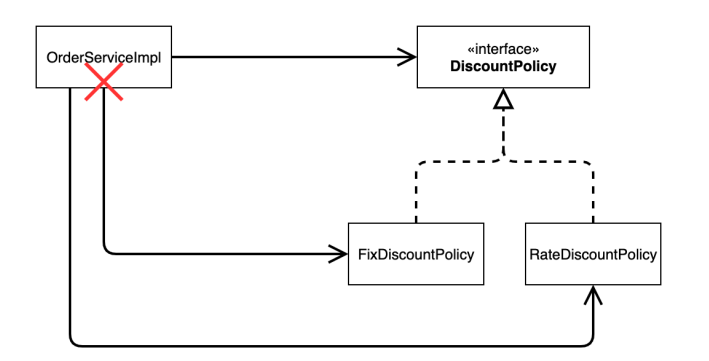
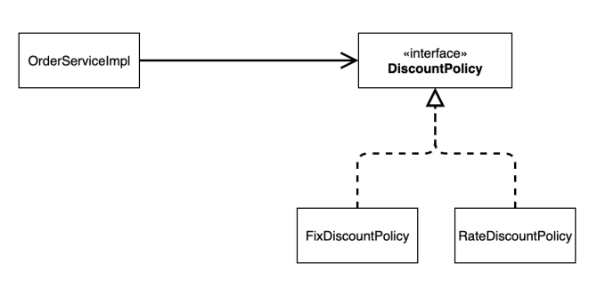

# 할인 정책을 애플리케이션에 적용해보자
할인 정책을 변경하려면 클라이언트인 `OrderServiceImpl` 코드를 고쳐야 한다.
```java
public class OrderServiceImpl implements OrderService {

    // private final DiscountPolicy discountPolicy = new FixDiscountPolicy(); // 변경 전
    private final DiscountPolicy discountPolicy = new RateDiscountPolicy(); // 변경 후
    ...
}
```
## 문제점 발견
* 우리는 역할과 구현을 충실하게 분리했다 -> OK
* 다형성도 활용하고, 인터페이스와 구현 객체를 분리했다 -> OK
* OCP, DIP 같은 객체지향 설계 원칙을 충실히 준수했다
    * 그렇게 보이지만 사실은 아니다.
* DIP: 주문 서비스 클라이언트(`OrderServiceImpl`)는  `DiscountPolicy`인터페이스에 의존하면서 DIP를 지킨 것 같은데?
    * 클래스 의존관계를 분석해 보자. 추상(인터페이스) 뿐만 아니라 **구체(구현)클래스에도 의존**하고 있다.
        * 추상 의존: `DiscountPolicy`
        * 구체(구현)클래스: `FixDiscountPolicy`, `RateDiscountPolicy`
* OCP: 변경하지 않고 확장할 수 있다고 했는데?!
    * **지금 코드는 기능을 확장해서 변경하면, 클라이언트 코드에 영향을 준다**따라서 **OCP를 위반**한다.

* 클래스 다이어그램으로 의존관계를 분석해보자.

**기대했던 의존관계**


지금까지 단순히 `DiscountPolicy` 인터페이스만 의존한다고 생각했다.

**실제 의존관계**


잘보면 클라이언트인 `OrderServiceImpl`이 `DiscountPolicy`인터페이스 뿐만 아니라 `FixDiscountPolicy`인 구체 클래스도 함께 의존하고 있다. 실제 코드를 보면 의존하고 있다. **DIP 위반**

**정책 변경**


**중요!:**: 그래서 `FixDiscountPolicy`를 `RateDiscountPolicy`로 변경하려는 순간 `OrderServiceImpl`의 소스코드도 함께 변경해야 한다! **OCP 위반**
## 해결방안
* 클라이언트 코드인 `OrderServiceImpl`은 `DiscountPolicy`의 인터페이스 뿐만 아니라 구체 클래스도 함께 의존한다.
* 그래서 구체 클래스를 변경할 때 클라이언트 코드도 함께 변경해야 한다.
* **DIP 위반** -> 추상(인터페이스)에만 의존하도록 변경
* DIP를 위반하지 않도록 인터페이스에만 의존하도록 의존관계를 변경하면 된다.

**인터페이스에만 의존하도록 설계를 변경**

```java
public class OrderServiceImpl implements OrderService {
    private final DiscountPolicy discountPolicy; // 인터페이스에만 의존
       ...
}
```
* 여기서 의문점이 들 수 있다. 구현체가 없는데 코드를 어떻게 실행할 수 있는가?
* 실행해보면 nul lpointer exception이 발생한다.
* 이 문제를 해결하려면 누군가가 클라이언트인 `OrderServiceImpl`에 `DiscountPolicy`의 구현 객체를 대신 생성하고 주입해야 한다.