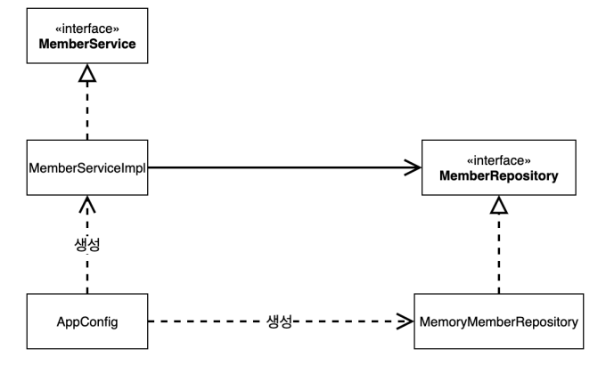

# 관심사의 분리
* 애플리케이션을 하나의 공연이라고 생각해보자. 각각의 인터페이스를 배역이락 생각하자. 그런데! 실제 배역 맞는 배우를 선택하는 것은 누구일까
* 로미오와 줄리엣 공연을 하면 로미오 역할을 누가 할지 줄리엣 역할을 누가 할지는 배우들이 정하는게 아니다. 이전 코드는 마치 로미오 역할(인터페이스)을 하는 디카프리오(구현체,  배우)가 줄리엣 역할(인터페이스)을 하는 여자 주인공(구현체, 배우)을 직접 초빙하는 것과 같다. 디카프리오는 공연도 해야하고 동시에 여자 주인공도 공연에 직접 초빙해야 하는 "다양한 책임"을 가지고 있다.

## 관심사를 분리하자
* 배우는 본인의 역할인 배역을 수행하는 것에만 집중해야 한다.
* 디카프리오는 어떤 여자 주인공이 선택되더라도 똑같이 공연할 수 있어야 한다.
* 공연을 구상하고, 담당 배우를 섭외하고, 역할에 맞는 배우를 지정하는 책임을 담당하는 별도의 **"공연 기획자"**가 나올 시점이다.
* 공연 기획자를 만들고, 배우와 공연 기획자의 책임을 확실히 분리하자.

# AppConfig 등장
* 애플리케이션의 동작 방식을 구성(config)하기 위해, "**구현 객체를 생성**",하고 "**연결**"하는 책임을 가지는 별도의 설정 클래스를 만들자.

* 먼저 AppConfig라는 클래스를 만들자
    * 이 클래스는 애플리케이션을 구성하는 모든 것들이 들어간다.
* MemoryServiceImpl이라는 구현 클래스는 MemberRepository 인터페이스가 있다.
    * 어떤 구현체를 사용할 건지는 AppConfig에서 넣어주자
        * 어떻게 넣어줄까?
            * 생성자 사용
    * 생성자를 통해 구현체를 넣어주는 방식을 **생성자 주입**이라고 한다.
* OrderServiceImpl도 마찬가지로

**AppConfig**
```java
public class AppConfig {

    public MemberService memberService(){
        return new MemberServiceImpl(new MemoryMemberRepository());
    }

    public OrderService orderService(){
        return new OrderServiceImpl(new MemoryMemberRepository(), new RateDiscountPolicy());
    }
}
```

이제 우리가 구현한 OrderServiceImpl 클래스를 살펴보자.
```java
public class OrderServiceImpl implements OrderService {

    private final MemberRepository memberRepository;
    private final DiscountPolicy discountPolicy;

    public OrderServiceImpl(MemberRepository memberRepository, DiscountPolicy discountPolicy) {
        this.memberRepository = memberRepository;
        this.discountPolicy = discountPolicy;
    }

    @Override
    public Order createOrder(Long memberId, String itemName, int itemPrice) {
        Member member = memberRepository.findById(memberId);
        int discountPrice = discountPolicy.discount(member, itemPrice);

        return new Order(memberId, itemName, itemPrice, discountPrice);
    }
}
```
작성한 코드는 철저하게 DIP를 지키고 있다. MemberRepository, DiscountPolicy 가 정확히 어떤 구현체인지 상관이 없이 작동한다.

* AppConfig는 애플리케이션의 실제 동작에 필요한 **구현 객체를 생성**
* AppConfig는 생성한 객체 인스턴스의 참조를 **생성자를 통해서 주입**해준다.
* 설계 변경으로 `MemberServiceImpl`은 `MemoryMemberRepository`를 의존하지 않는다
    * 단지 `MemberRepository` 인터페이스만 의존한다.
* `MemberRepository` 입장에서 생성자를 통해 어떤 구현 객체가 들어올지는 알 수 없다.
* `MemberRepository` 의 생성자를 통해서 어떤 구현 객체를 주입할지는 오직 외부(`AppConfig`)에서 결정된다.
* `MemberRepository` 은 이제부터 "**의존관계에 대한 고민은 외부**"에 맡기고 "**실행에만 집중**"하면 된다.

**그림 - 클래스 다이어그램**


* 객체의 생성과 연결은 `AppConfig`가 담당
* **DIP 완성**: `MemberServiceImpl`은 `MemberRepository`인 추상에만 의존하면 된다.
* **관심사의 분리**: 객체를 생성하고 연결하는 역할과 실행하는 역할이 명확히 분리되었다.

**그림 - 회원 객체 인스턴스 다이어그램**


* `appConfig`객체는 `memoryMemberRepository` 객체를 생성하고 그 참조값을 memberServiceImpl을 생성하면서 생성자로 전달한다.
* 클라이언트인 `memberServiceImpl` 입장에서 보면 의존관계를 마치 외부에서 주입해주는 것 같다고 해서 **DI(Dependency Injection)** 우리말로 **의존관계 주입** 또는 **의존성 주입**이라 한다.

## 정리
* `AppConfig`를 통해서 관심사를 확실하게 분리
* 배역, 배우를 생각해보자
* `AppConfig`는 공연 기획자'
* `AppConfig`는 구체 클래스를 선택, 배역에 맞는 담당 배우를 선택, 애플리케이션이 어떻게 동작해야 할지 전체 구성을 책임짐
* 이제 각 배우들은 담당 기능을 실행하는 책임만 지면 됨
* `OrderServiceImpl`은 기능을 실행하는 책임만 지면 됨