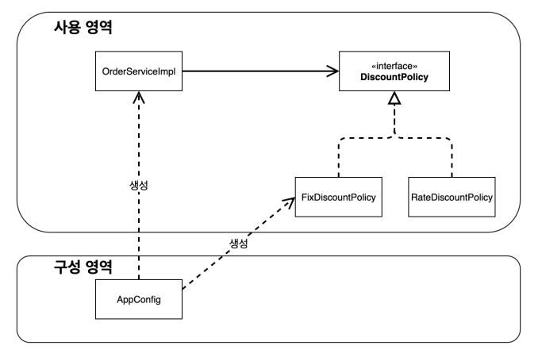

# 새로운 구조와 할인 정책 적용
* 처음으로 돌아가서 정액 할인 정책을 정률 할인 정책으로 바꾸자
* FixDiscountPolicy -> RateDiscountPolicy

> `AppConfig`의 등장으로 애플리케이션이 크게 사용 영역과, 객체를 생성하고 구성(Configuration)하는 영역으로 분리되었다.

**그림 - 사용, 구성의 분리**


**그림 - 할인 정책의 변경**


* 구성 영역의 코드만 고치면 되고, 사용 영역의 코드는 전혀 고칠 필요가 없다.

**AppConfig**
```java
    public DiscountPolicy discountPolicy(){
        return new RateDiscountPolicy(); // 이 부분만 변경하면 된다.
    }
```