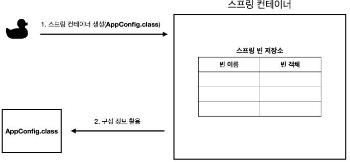
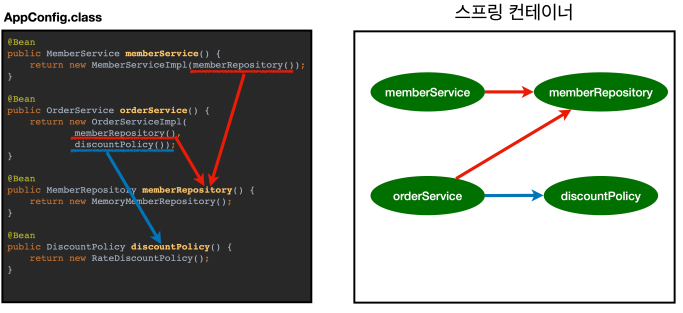

# 스프링 컨테이너 생성
스프링 컨테이너 생성되는 과정
```java
ApplicationContext applicationContext = new AnnotationConfigApplicationContext(AppConfig.class);
```
* `ApplicationContext`를 스프링 컨테이너라 함
* `ApplicationContext`는 인터페이스
* 스프링 컨테이너는 XML을 기반으로 만들 수 있고, 애노테이션 기반의 자바 설정 클래스로 스프링 컨테이너를 만드는 것
* 자바 설정 클래스를 기반으로 스프링 컨테이너(`ApplicationContext`)를 만들기
  * `new AnnotationConfigApplicationContext(AppConfig.class);`
  * `AnnotationConfigApplicationContext`클래스는 `ApplicationContext`인터페이스의 구현체
> 더 정확히는 스프링 컨테이너를 부를 때 `BeanFactory`, `ApplicationContext`로 구분해서 이야기한다. `BeanFactory`를 직접 사용하는 경우는 거의 없의므로 `ApplicationContext`를 스프링 컨테이너라 함.

## 스프링 컨테이너의 생성 과정
**1. 스프링 컨테이너 생성**

* `new AnnotationConfigApplicationContext(AppConfig.class)`
* 스프링 컨테이너를 생성할 때는 구성 정보를 지정해주어야 함
* 여기선 `AppConfig.class`를 구성 정보로 지정함

**2. 스프링 빈 등록**

* 스프링 컨테이너는 파라미터로 넘어온 설정 클래스 정보를 사용해서 스프링 빈을 등록
* **빈 이름**
  * 빈 이름은 메서드 이름을 사용
  * 빈 이름을 직접 부여할 수 있음
    * `@Bean(name="memberService2")`
> **<span style="color:red">주의!!</span> 빈 이름은 항상 다른 이름을 부여**해야 한다. 같은 이름을 부여하면, 다른 빈이 무시되거나, 기존 빈을 덮어버리거나 설정에 따라 오류가 발생한다.

**3. 스프링 빈 의존관계 설정 - 준비**


**4. 스프링 빈 의존관계 설정 - 완료**

* 스프링 컨테이너는 설정 정보를 참고해서 의존관계를 주입(DI)
