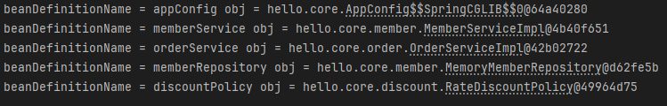

# 컨테이너에 등록된 모든 빈 조회
```java
class ApplicationContextInfoTest {

    AnnotationConfigApplicationContext ac = new AnnotationConfigApplicationContext(AppConfig.class);
    
    @Test
    @DisplayName("모든 빈 출력")
    void findAllBean(){
        String[] beanDefinitionNames = ac.getBeanDefinitionNames();
        for (String beanDefinitionName : beanDefinitionNames) {
            Object obj = ac.getBean(beanDefinitionName);
            System.out.println("beanDefinitionName = " + beanDefinitionName + " obj = " + obj);
        }
    }

    @Test
    @DisplayName("애플리케이션 빈 출력")
    void findApplicationBean(){
        String[] beanDefinitionNames = ac.getBeanDefinitionNames();
        for (String beanDefinitionName : beanDefinitionNames) {
            BeanDefinition beanDefinition = ac.getBeanDefinition(beanDefinitionName);
            if(beanDefinition.getRole() == BeanDefinition.ROLE_APPLICATION){
                Object obj = ac.getBean(beanDefinitionName);
                System.out.println("beanDefinitionName = " + beanDefinitionName + " obj = " + obj);
            }
        }
    }
}
```

* `getBeanDefinitionNames()`를 통해 등록된 빈의 이름을 가져올 수 있다.
* `getBeanDefinition("빈 이름")`을 통해 메타정보를 가져올 수 있다.
  *  `getRole()`로 role을 가져올 수 있는데, `BeanDefinition.APPLICATION`은 내가 애플리케이션을 만들기 위해 등록한 빈인지 알 수 있다. 

*  실행을 해보면 다음과 같은 출력을 얻을 수 있다.
 